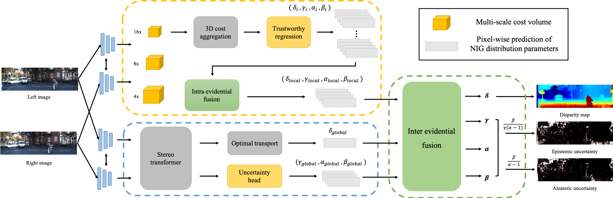

# ELFNet



This is a PyTorch implementation of the paper [ELFNet: Evidential Local-global Fusion for Stereo Matching]()  (ICCV 2023).

## Environment

You can create a conda environment with following commands.

```shell
conda create env -n elfnet python=3.8
conda activate elfnet
conda install pytorch torchvision torchaudio pytorch-cuda=11.7 -c pytorch -c nvidia
pip install -r requirements.txt
```

## Data Preparation

### Scene Flow

```
SCENE_FLOW
    |_ frames_finalpass
        |_ TRAIN
            |_ A
                |_0000
    |_ disparity
        |_ TRAIN
            |_ A
                |_0000
    |_ occlusion
        |_ TRAIN
            |_ left
```

You may need to run  `./utilities/subsample_sceneflow.py` to down sample the data.

### KITTI 2012 & KITTI 2015

```
KITTI
    |_2012
          |_ training
              |_ disp_occ
              |_ colored_0
              |_ colored_1
    |_2015
          |_ training
              |_ disp_occ_0
              |_ image_2
              |_ image_3
```

### Middlebury 2014

```
MIDDLEBURY
    |_ trainingQ
        |_ Motorcycle
            |_ disp0GT.pfm
            |_ disp1GT.pfm
            |_ im0.png
            |_ im1.png
            |_ mask0nocc.png
            |_ mask1nocc.png
```

## Experiments

### Training

```shell
sh scripts/elfnet_pretrain.sh
```

You can download the checkpoint pretrained on Scene Flow Dataset from this [Google Drive link](https://drive.google.com/file/d/16ViZY16-rtTK1oFnMAmlahh3gXfEAVCP/view?usp=share_link). (Note that you don't need to untar the checkpoint.)

### Evaluation

```shell
sh scripts/elfnet_test_sceneflow.sh
sh scripts/elfnet_test_kitti.sh
sh scripts/elfnet_test_middlebury.sh
```

## Citation
If you find our work useful or provides some new insights😊, please consider citing our paper using the following BibTeX entry.

```
@article{lou2023elfnet,
  title={ELFNet: Evidential Local-global Fusion for Stereo Matching},
  author={Lou, Jieming and Liu, Weide and Chen, Zhuo and Liu, Fayao and Cheng, Jun},
  journal={arXiv preprint arXiv:2308.00728},
  year={2023}
}
```

## Acknowledgements

We thank for the code implementation from [PCWNet](https://github.com/gallenszl/PCWNet), [STTR](https://github.com/mli0603/stereo-transformer) and [Evidential-deep-learning](https://github.com/aamini/evidential-deep-learning).

